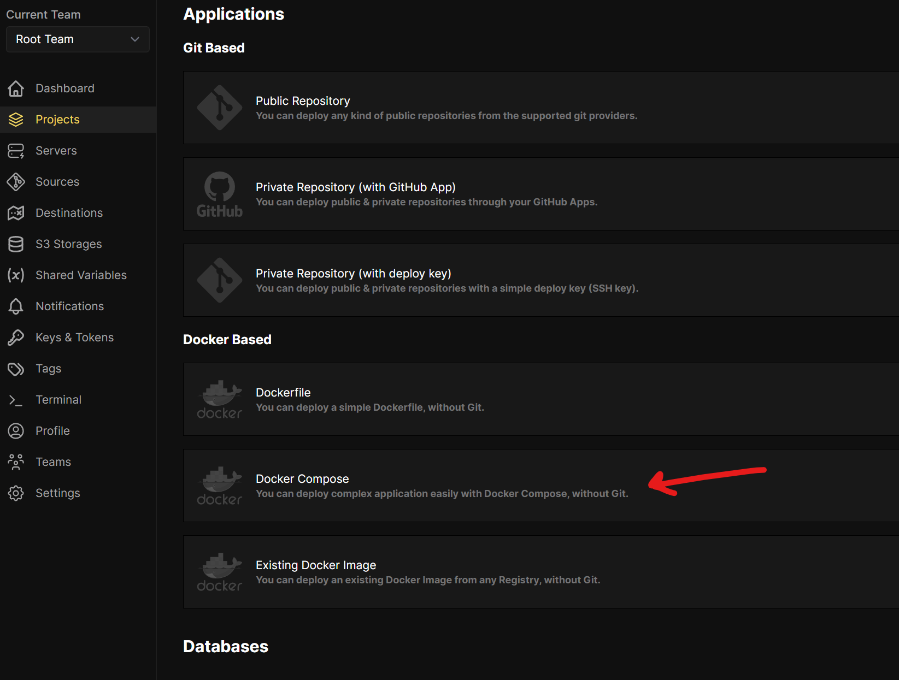
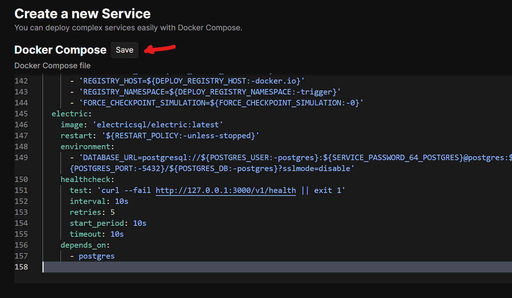
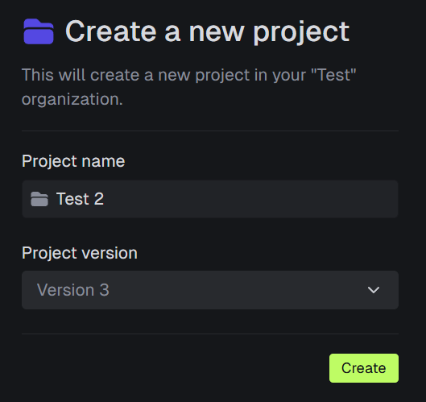
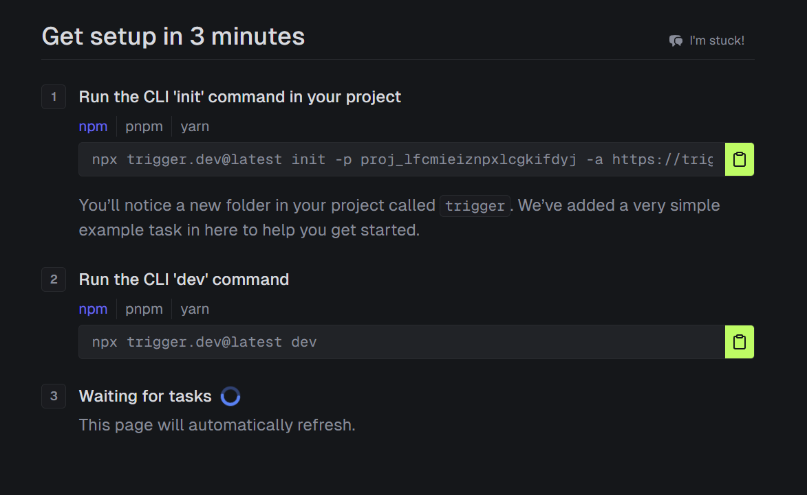
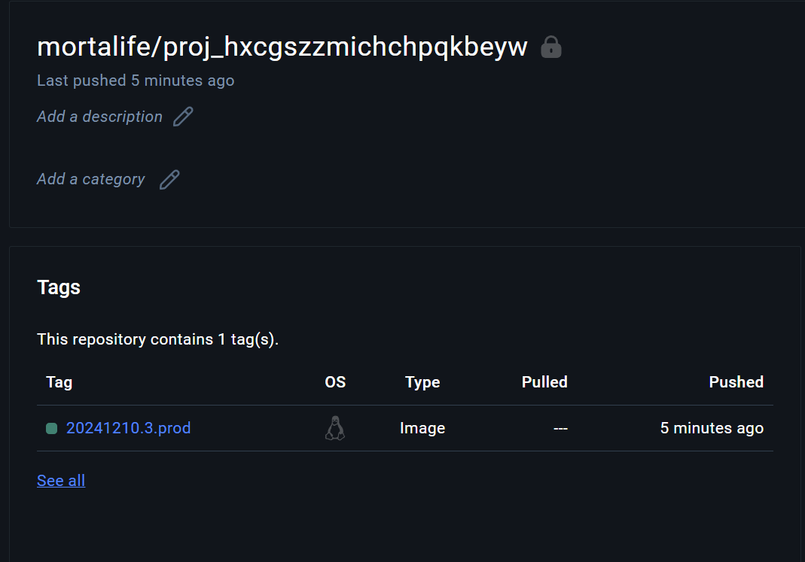
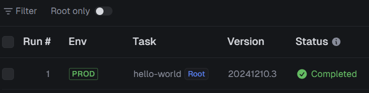

# Coolify Compatible Trigger.dev Template

This repository contains a docker-compose that runs trigger.dev on coolify, with additional instructions on what's needed to get started.

1. Create a new resource in Coolify by selecting the "Docker Compose" option
   
2. Select your server and Copy the `docker-compose.yml` into window and press **Save**
   
3. Set the required environment variables
   There are a few required environment variables you should set to allow you to login and to receive magic email links (these can also be copied from the webapp logs if not set). When setting the environment variable make sure you click **Update**

   - **REPLY_TO_EMAIL** (Set to the same as from email for ease)
   - **FROM_EMAIL** (Email that is in an approved domain in resend)
   - **DEPLOY_REGISTRY_NAMESPACE** (This is your docker namespace if using docker hub which is usually your organisation or username)
   - **DEPLOY_REGISTRY_HOST** (If not using docker hub)
   - **ADMIN_EMAILS** (Which emails should be admins)
   - **RESEND_API_KEY** (Send emails for magic links requires resend setting up)
   - **WHITELISTED_EMAILS** (These are the emails you want to allow to login, if more than one you can use the pipe as a separator as like the default)

4. Start the services
5. Login to docker in the docker-provider
   Click "Terminal", select a container, select the option starting "docker-provider", and connect.
   Once you're connected run the command: docker login
   Provide your docker username and password so that the docker-provider call pull the images you create later from your repository
6. Open up the Coolify url click links and select the one which starts with "trigger".
7. Login with your admin email specified above
8. Click the link (either from the email or by copying the url from the webapp container logs)
9. Create an account, and a V3 project
   
10. You'll be provided with a screen to setup your first project like below:
    
    You're now ready to setup your docker registry
11. Login to docker hub and create a new registry
    The namespace should be what your configured earlier
    The registry should be your project ref as shown in the image above, eg: **proj_lfcmieiznpxlcgkifdyj**
    Create it
12. Login to on your dev machine
    If you already have an account setup either logout or create a new profile

    `npx trigger.dev@latest login --profile test -a https://trigger-asdasdasdswg234sd.yourdomain.com`
    
    This commands creates a new profile called test, omit `--profile test` if you don't use another account

    `npx trigger.dev@latest init --profile test -p proj_lfcmieiznpxlcgkifdyj -a https://trigger-asdasdasdswg234sd.yourdomain.com`
    
    This command is the one you're given in the image above, but it also includes a profile, if you're not using profiles feel free to copy from the dashboard.

    If you're following along just select the `hello-world` example.

    `npx trigger.dev@latest dev --profile test`
    
    Run your dev server

14. Test running a dev trigger
    In the dashboard, click **Test**, select your hello world example, click "Run test" or `CTRL+ENTER`
    You should now see it running in your dev console

15. Ensure you're logged into docker on your dev machine.
    Run `docker login` and login with the same credentials as before.

16. Deploy your tasks to docker hub
    Run the deploy command

    `npx trigger.dev@latest deploy --profile test --self-hosted --push`

18. Once complete, test running a prod trigger.
    In the dashboard, click **Test**, select the Prod environment, select your hello world example, click "Run test" or `CTRL+ENTER`

    It may take a few seconds to start as it has to pull the image from docker.

    

19. Profit
